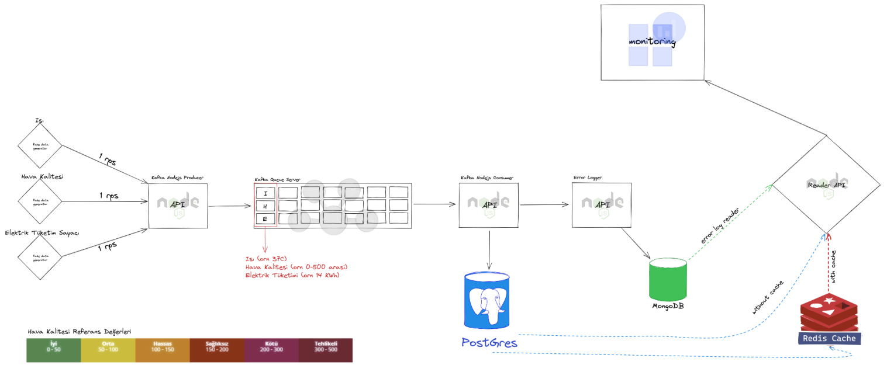

# Okul Enerji Takip Sistemi

## Tanıtım

Okul enerji takip sistemi (monitoring). 
Okullarda bulunan sınıfların, ısı dereceleri, hava kaliteleri ve sınıfın ortalama elektrik tüketimini takip edebileceğimiz bir microservice serisiyapılacak.

3 farklı sensor simule edilip saniyelik olarak data üretecek. Üretilen bu data REST API (producer) tarafından okunup kuyruğa eklenecek. Kuyruğa eklenen verilerin işlenmesini yine REST API(consumer) tarafı işleyip veritabanına kaydedecek. Hata oluşması durumunda Mongodb’ye error logları başka bir API ile işlenecek. Son olarak tüm dataları okumak ve error logları takip için bir Reader API geliştirilip sistemin herşeyi o api aracılığı ile analiz ya da monitorize edilebilecek.

- Sistemde 3 farklı veritabanı kullanılacak.
- Tüm Servisler NodeJS ile yazılacak
- Geliştirme ortamı olarak Docker teknolojisi kullanılacak
- Tüm öğrencilere Nodejs Microservice kemik yapısı ile docker dosyaları oluşturuldu ve dağıtıldı.
- Redis ile de kısa süreli cache yapısı kullanılacak
- Proje öğrencilere giriş seviyesinde anlatıldı
- Tüm öğrenciler 6 kişilik gruplarda küme halinde çalışacaklar.
- Her grubun başında bir yönlendirici ve her yönlendiriciye yardımcı olacak bir inavitas çalışanı olacak. Resim 2 de çalışma grupları listelenmiştir.
- Resim 1 de ise projenin ana hatları ve yapısı şema halinde
  gösterilmiştir.

## Mikro Servisler

- Sensor reader (Producer)
- Kafka data reader (Consumer)
- Error Log collector
- Data reader class by class

## Sensörler & Araçlar

- Isı sensörü
- Hava Kalite Ölçüm
- Elektrik Tüketim Sayacı

## Kullanılacak Teknolojiler

- NodeJS (REST API)
- PostgreSQL (Ana veritabanı)
- Redis (Cache Veritabanı)
- MongoDB (Error Loglama Veritabanı)
- Kafka (Kuyruk Sistemi)

## Kullanılacak Teknolojiler
-Swagger (Dokümantasyon Kütüphanesi)

## Mimari

